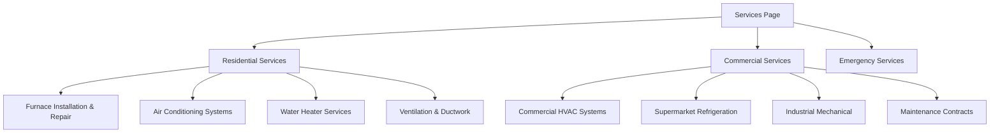

# Service Structure Visualization

## Current vs. New Structure

### Before (Current Structure)

### After (New Structure)

```mermaid
graph TD
    A[Services Page] --> B[HVAC Systems]
    A --> C[Refrigeration Solutions]
    A --> D[Controls & Automation]
    A --> E[Hot Water & Mechanical]
    A --> F[Indoor Air Quality]
    A --> G[Emergency Services]
    
    B --> B1[Residential: Furnaces, Heat Pumps, Ductless Splits]
    B --> B2[Commercial: RTUs, Chillers, Hydronic Systems]
    B --> B3[Ductwork Design & Fabrication]
    B --> B4[VFDs, Pumps, Motor Control]
    B --> B5[Smart Thermostat Upgrades]
    
    C --> C1[Walk-in Coolers & Freezers]
    C --> C2[Reach-in Refrigeration Units]
    C --> C3[Compressor Replacements]
    C --> C4[Refrigerant Retrofits]
    C --> C5[Preventive Maintenance]
    
    D --> D1[Emerson, Danfoss, Daikin Controls]
    D --> D2[MicroTech II, Micro Therm]
    D --> D3[BMS Integration]
    D --> D4[Custom Control Solutions]
    
    E --> E1[Boilers & Hot Water Systems]
    E --> E2[Combustion Analysis & CO Testing]
    E --> E3[Pump Repair/Replacement]
    E --> E4[Mechanical Room Service]
    
    F --> F1[IAQ Assessments]
    F --> F2[Filter Upgrades MERV 11-16, HEPA]
    F --> F3[UV Lights, Air Purifiers]
    F --> F4[Humidity Control Systems]
    F --> F5[CO/CO2 Monitoring]
```

## Key Benefits of New Structure

1. **Service Expertise Focus**: Each section showcases specialized technical knowledge
2. **Customer Journey Alignment**: Customers find services by problem type, not building type
3. **SEO Optimization**: Each category becomes a keyword-rich content hub
4. **Scalable Growth**: New services fit naturally into existing categories
5. **Professional Positioning**: Demonstrates comprehensive mechanical expertise